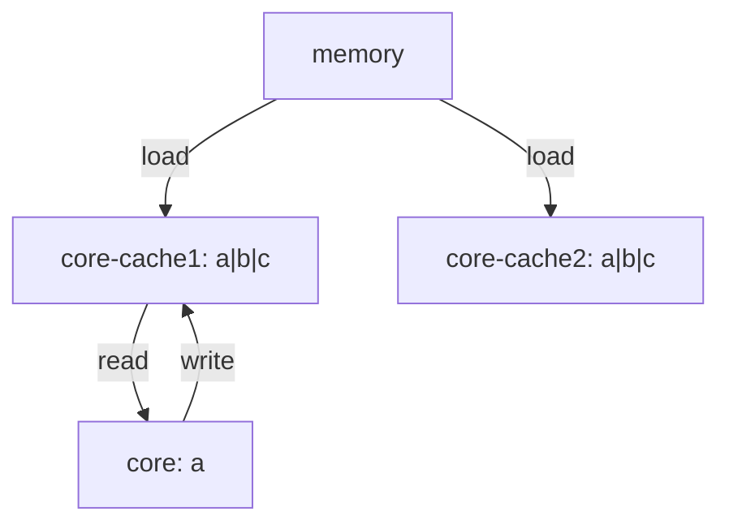

# 结构体内存对齐

不同的数据类型，会更具其类型大小具有特定的对齐要求，对于结构体而言为了满足对齐要求，可能会在结构体中间插入额外的空间进行填充 `padding`
内存对齐是为了适应 `CPU` 对结构体数据进行快速访问

如果采用紧凑内存布局 `T1` 中的 `b` 需要三个 `CPU` 访问才能读完， `T2` 中只需要两次，所以内存对齐可以提高 `CPU` 访问速度

结构体最终分配的内存大小是所有字段中最大对齐系数的整数倍

# `CPU` 访问

计算机 `CPU` 一次处理数据的位数通常为 `32` 或者 `64` 字长
读取数据时是按照字长的倍数来读取的

### CPU 缓存 - 伪共享

缓存中最小的单位是缓存行，当 `CPU` 从内存中读取一个变量时，会同时读取该变量附近的其他变量



当 `core` 跟新变量时，即使 `b` 没有被修改 `core-cache2` 中的缓存也会失效，需要重新加载所有缓存
这个就是伪共享，一个核心更新变量会导致其他核心也更新缓存，如果变量总是存在于多个核中，将会显著影响性能

### 缓存填充

在变量之间填充一些无意义的变量，使得一个变量占据一个核心的缓存行，这样一个变量更新时不会影响到其他
测试案例中，数组中的元素可能共享相同的缓存行，多个 `goroutine` 同时修改相邻的元素会导致缓存行失效
高频访问元素之间加入缓存填充，使得每个元素占据一个缓存行，可以减少缓存行失效的情况

# 对齐规则

- 任意类型
  - `unsafe.Alignof` 至少为 1
- 结构体类型
  - `unsafe.Alignof` 为所有字段中的最大值，至少为 1
- 数组
  - 数组元素类型相同
- 空结构体
  - 当空结构体作为外层结构体最后一个字段
    - 如果指针指向这个空结构体字段，这个指针将会得到一个超出该结构体分配的内存地址，只要返回的地址的指针被引用，其分配的内存块不会被垃圾回收，可能导致内存泄漏
    - 为了防止内存泄漏，编译器在最后一个零大小的字段填充一些字节来避免

### `unsafe`

- `Sizeof`
  - 计算类型示例长度
- `Offsetof`
  - 计算结构体字段偏移量
  - 传入非结构体，编译可以通过，运行时报错
- `Alignof`
  - 类型示例对齐系数

### 原子操作

在 `atomic` 库文档里面，开发者在 `32-bit` 平台调用 `atomic` 进行 `64` 位原子操作时，有责任保证操作对象 `8` 字节对齐

结构体在 32 位平台上是 4 字节对齐，64 位平台上需要 8 字节，如果对一个未对齐的地址进行原子操作，程序就会 `panic`

### 伪共享

`sync.Pool` 包通过手动对齐的方式来避免问题
```text
type poolLocal struct {
	poolLocalInternal

	// Prevents false sharing on widespread platforms with
	// 128 mod (cache line size) = 0 .
	pad [128 - unsafe.Sizeof(poolLocalInternal{})%128]byte
}
```

### hot path

频繁访问的指令，访问结构体第一个字段之后才能访问第二个
为了提高性能，需要被频繁操作的字段需要放在前面

# 工具

### 检查结构体内存占用是否可优化

`golangci-lint` 中的 `govet` 支持分析结构体占用

### 自动更正结构体字段位置

`fieldalignment`

```bash
go install golang.org/x/tools/go/analysis/passes/fieldalignment/cmd/fieldalignment@latest
fieldalignment -fix main.go 
```


